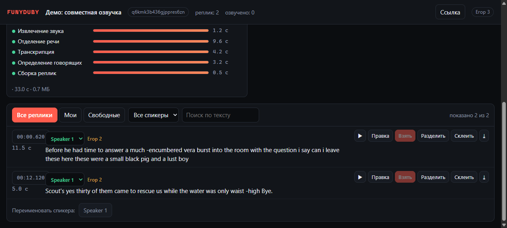
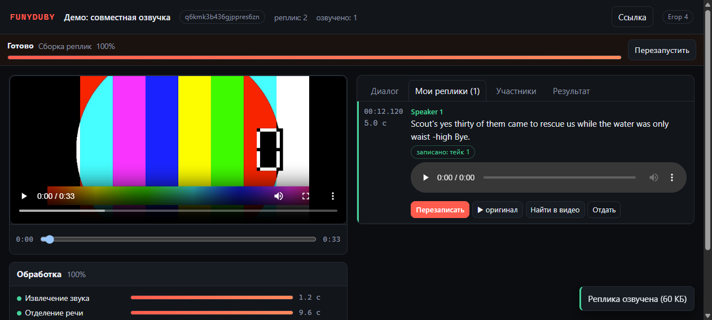
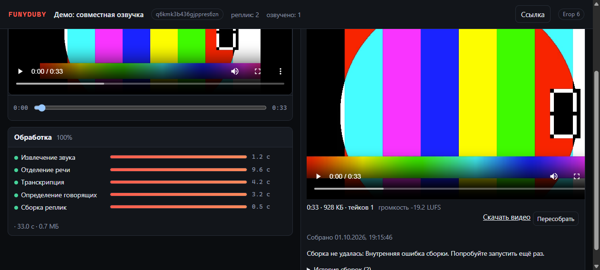
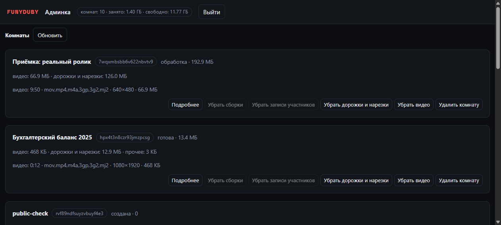
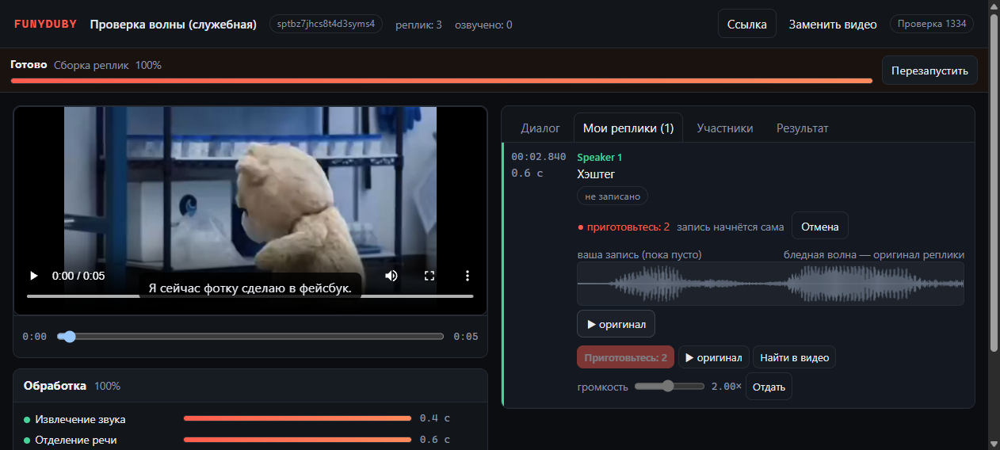
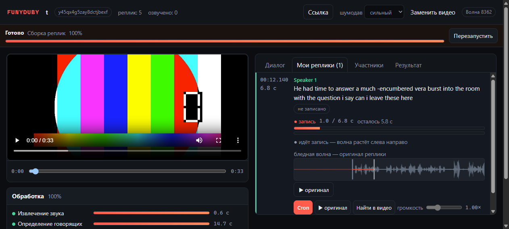
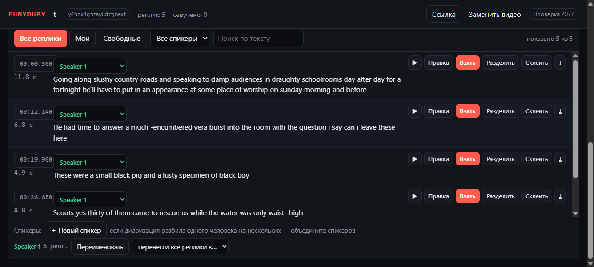

# Collaborative Video Dubbing Platform

Совместная озвучка видео: одна ссылка на комнату, автоматический разбор аудиодорожки
(разделение речи, STT, диаризация), запись реплик с микрофона участниками и финальная
сборка видео с сохранением музыки и SFX.

* Архитектура и все решения: [`docs/ARCHITECTURE.md`](docs/ARCHITECTURE.md)
* Эксплуатация и разбор проблем: [`docs/RUNBOOK.md`](docs/RUNBOOK.md)
* Проверка API: `bash scripts/smoke_api.sh`

## Статус

| Этап roadmap | Состояние |
|---|---|
| 1. Инфраструктура (compose, образы, health) | готово — GPU-контейнеры работают (`nvidia-container-toolkit 1.20.1`) |
| 2. Схема БД и миграции | готово — 11 таблиц, 2 миграции |
| 3. Backend core: комнаты, участники, права | готово |
| 4. Загрузка видео (ffprobe, лимиты, Range) | готово |
| 5. Очередь, этапы конвейера, SSE, реконсилятор | готово |
| 6. ML-конвейер: отделение речи, STT, диаризация, нарезка реплик | работает end-to-end, включая **Bandit v2** (D1) с весами Zenodo |
| 7. Диалог: правки, разделение/склейка, спикеры, назначения, медиа | готово — 27 эндпоинтов, назначения с защитой от гонки |
| 8. Frontend комнаты (React + Vite) | готово — диалог, мои реплики, участники, прогресс по SSE |
| 9. Запись голоса | готово — автостоп по длительности реплики, тейки, выбор актуального |
| 10. Финальный микс (фон + тейки по таймкодам) | готово — numpy PCM, фейды, перекрёстные затухания, подрезка потолка |
| 11. Рендер итогового файла | готово — `-c:v copy` (картинка не перекодируется) + AAC 192k, `+faststart` |
| 12. Скачивание и страница результата | готово — вкладка «Результат»: плеер, размер, громкость, скачивание, история |
| 13-16. Тесты, e2e, стабилизация | смоук 101 проверка, сквозные сценарии 15 (диалог) и 6 (сборка), юнит-тесты фронтенда 14 |







Проверки на сервере:

```bash
make smoke                      # 101 проверка API: комнаты, права, медиа, очередь, этапы, правки, назначения, запись, сборка, purge
bash scripts/e2e_stage7.sh      # сквозной сценарий: комната -> видео -> конвейер -> правка -> повторная обработка
bash scripts/e2e_render.sh      # сквозной сценарий сборки: клип -> конвейер -> запись -> готовое видео (+ проверка звука)
bash scripts/diag_room.sh <room> # состояние комнаты: реплики, нарезки, сироты, этапы
cd frontend && npm test         # 14 юнит-тестов SPA (клиент API, диалог, статус обработки, рекордер)
```

Сборка итогового видео (этапы 10-12): микс считается в numpy (фон комнаты + актуальные тейки по
таймкодам, фейды по краям вставок, перекрёстные затухания на перекрытиях, подрезка потолка −1 дБ
вместо клиппинга), затем ffmpeg мультиплексирует результат с исходным видео через `-c:v copy` —
картинка не перекодируется. Проверено сквозным сценарием на клипе с речью: длительность итогового
файла совпадает с исходником, а в окне озвученной реплики корреляция с загруженным тейком 0.986
против 0.082 с оригинальной речью — то есть реплика действительно заменена, а не подмешана.
Повторная заявка с теми же параметрами не считает микс заново: отпечаток диалога включает актуальные
тейки, поэтому смена дубля или правка текста инвалидируют готовый файл, а идентичное состояние
отдаёт уже собранный результат.



Приёмка на реальном киноролике (фрагмент 9:50 из «His Girl Friday», общественное достояние):
извлечение звука 2.6 с, разделение речи 255 с, распознавание 78 с, диаризация 49 с, склейка 26 с —
всего 411 с на 590 с видео (0.7 от реального времени на RTX 3060). Диаризация нашла **два голоса**
на настоящем диалоге (230 реплик, 428 с речи, распределение 115/115), утечка речи в фон в окнах
речи **−54.5 дБ** при речи −35.3 дБ. Сборка заняла 47 с, итоговый файл 69 МБ против 67 МБ исходника,
длительность совпала, видео скопировано без перекодирования, а в озвученной реплике корреляция с
записью участника 1.000 против 0.009 с оригинальным голосом.

Удаление комнаты проверяется скриптом `scripts/check_room_deletion.sh`: комната проходит весь путь
(видео → конвейер → запись → сборка), затем удаляется через админку, и после этого проверяется, что
каталога на диске нет, строки комнаты нет и ни в одной таблице с колонкой `room_id` (обход по
каталогу БД, а не по списку) не осталось упоминаний. Плюс админка показывает каталоги, чьи комнаты
уже удалены («файлы без комнат») — именно так находится расхождение диска с базой после сбоев уборки.

### Запись голоса: волна, отсчёт, громкость

В «Моих репликах» участник видит **волну звука**: оригинальная реплика нарисована бледной
подложкой, своя запись — поверх неё, в тех же координатах времени. Во время записи волна растёт
слева направо, а белая отметка показывает, докуда дошла запись и сколько осталось до конца
реплики, — так видно, попадаешь ли ты в фразу.



Во время записи видно, как волна растёт поверх оригинала:



Запись стартует **сразу по нажатию**, но первые три секунды — **разгон**: они пишутся и тут же
отбрасываются сервером. За это время участник собирается и начинает вместе с оригиналом, поэтому
в реплику попадает только сама реплика.

На волне разгон — это часть записи: собственная волна растёт слева направо с первого мгновения
без остановок, курсор идёт непрерывно, а бледная волна оригинала подставлена ровно под ту часть,
которая станет репликой. Разгон нарисован поверх пустого места полупрозрачным — видно, что он
пишется, но в реплику не попадёт. Пока разгон идёт, интерфейс пишет «● разгон» с остатком секунд,
а кнопка «Отменить разгон» выбрасывает запись целиком. Запись останавливается сама ровно на
длительности реплики (плюс разгон).

Записи чистит **шумоподавление**. Сила выбирается в шапке комнаты («шумодав»: выкл / мягкий /
обычный / сильный, по умолчанию сильный) — это одна и та же цепочка `highpass` + `anlmdn`, у
сильного в конце добавлен спектральный гейт `afftdn`.

Сила подобрана измерениями на настоящей речи (речь плюс шум микрофона, относительно идеально
чистой записи): шум в паузах оказывается тише на 23 дБ при мягком, 29 дБ при обычном и 55 дБ при
сильном, а сам голос теряет 0.4, 0.5 и 1.1 дБ соответственно. `afftdn` в одиночку давал всего
8 дБ, поэтому как самостоятельный шумодав он не используется.

**Громкость микрофона** регулируется ползунком (0.25×–4×, настройка хранится в браузере
участника). Усилитель стоит до рекордера, поэтому в файл попадает уже выправленный звук, и
индикатор уровня показывает ровно то, что запишется.

Тейков на реплику может быть несколько (история), но выбора между ними нет: **актуален всегда
последний** — нажал «Перезаписать», записал, и именно эта запись идёт в сборку. Так же работает
и сервер: новая запись помечается текущей, прошлые остаются в истории.

Адрес файла тейка при этом не меняется (он один на реплику), поэтому в интерфейсе к адресу
добавляется версия — идентификатор актуального тейка. Без неё браузер отдавал из кеша старую
запись: слышно было первый тейк, хотя в сборку уходил последний. Сервер со своей стороны отдаёт
тейки без кеша.

### Спикеры: исправить диаризацию руками

Диаризация ошибается на перекрытиях и на похожих голосах, поэтому спикерами можно управлять:

- **в реплике** — выпадающий список спикеров и пункт «＋ новый спикер…»: реплику можно отдать
  другому голосу или завести для неё нового;
- **в панели «Спикеры»** — создание нового спикера («＋ Новый спикер»), переименование и
  **перенос всех реплик** спикера другому («перенести все реплики в…» → существующий или новый).
  Это лечение типового случая, когда один человек разбит диаризацией на двух.



Новый спикер, которому ещё не назначены реплики, хранится в браузере участника — серверу
показывать его рано, пока он не привязан ни к одной реплике.

### Новое видео в существующей комнате

В шапке комнаты есть кнопка **«Заменить видео»**. Замена — процедура разрушительная: реплики,
записи участников и готовые сборки относились к прежнему монтажу, поэтому сервер удаляет их
вместе со старым файлом (кнопка предупреждает об этом заранее, обычная повторная загрузка без
подтверждения отвечает отказом `video_exists`). После замены комната разбирается заново: снова
отделение речи, распознавание и диаризация.

### HTTPS и микрофон

Браузер отдаёт микрофон только в защищённом контексте (`isSecureContext`), поэтому на `http://…`
`navigator.mediaDevices` просто нет — запись физически невозможна. Провайдер пробрасывает наружу
единственный порт 3001, на котором живут ещё kacheck и ComfyUI API, поэтому на этом порту сделан
мультиплексор: nginx смотрит на первый байт соединения (`ssl_preread`) и разводит трафик — TLS идёт
в https-блок, обычный http остаётся как был.

```
stream { map $ssl_preread_protocol $dub_backend { "" 127.0.0.1:3080; default 127.0.0.1:3443; } … }
http   { server { listen 127.0.0.1:3080 proxy_protocol; … } }   # прежние проекты, http
       { server { listen 127.0.0.1:3443 ssl proxy_protocol; … } } # https с сертификатом
```

Сертификат — Let's Encrypt через DuckDNS (DNS-01: входящие порты не нужны), домен `egrigorich.duckdns.org` (в сертификате и второе имя, `funydub.duckdns.org`, — чтобы выданные ранее ссылки работали),
автопродление — задание acme.sh в cron. Итоговый адрес интерфейса:
`https://egrigorich.duckdns.org:3001/dub/` — без предупреждений браузера и без установки чего-либо
у участников. Скрипты: `scripts/setup_https_mux.sh` (мультиплексор, с бэкапами и автооткатом),
`scripts/setup_le_cert.sh` (выпуск и установка сертификата).

Админка — `/dub/admin` (на сервере: http://155.212.24.77:3001/dub/admin). Доступ по отдельному
токену `ADMIN_TOKEN` из `.env` (заголовок `X-Admin-Token`); пусто — админка выключена и отвечает
`admin_disabled`, а не открыта молча. Показывает все комнаты, их размер и разбивку по категориям
(видео, дорожки и нарезки, записи участников, готовые сборки), а по раскрытию — конкретные файлы
с размерами и датами. Убирать можно точечно: сборки, записи, дорожки и нарезки, исходное видео —
или удалить комнату целиком. Удаление «исходного видео» единственное меняет состояние комнаты:
вместе с файлом уходят джоб, реплики и записи (они ссылаются на несуществующий ролик), а комната
возвращается в состояние «загрузите видео»; готовые сборки при этом остаются скачиваемыми.

Запись голоса: браузер пишет webm/opus, клиент останавливает запись ровно на длительности реплики,
сервер **повторно** измеряет длительность и отклоняет переросшую запись (`recording_too_long`), затем
нормализует тейк до точной длины (`atrim` + `apad`) и громкости (`loudnorm`). Важная деталь: у webm из
MediaRecorder нет заголовка Duration, поэтому длительность измеряется декодированием — иначе лимит
молча не работал бы (проверяется в смоуке на файле, собранном через pipe).

Фронтенд: React 18 + Vite, без UI-библиотек (тёмная тема на CSS-переменных, 61 КБ gzip JS).
Сборка идёт в builder-стадии `frontend/Dockerfile`, отдаёт статику nginx с прокси на API и SSE.
Локальная разработка: `cd frontend && npm install && npm run dev` (проксирует `/api` на `127.0.0.1:8091`).

Важно при выкладке: код смонтирован в контейнеры, поэтому `docker compose up -d` **не** перезапускает
процессы с устаревшими модулями Python. Используйте `make deploy` (делает `--force-recreate`) или
`make restart`, иначе воркер может часами исполнять старый код (так этап нарезки незаметно работал
старой версией после правок).

Результат прогона ML-конвейера на тестовом клипе (33 с, речь поверх музыки), бэкенд Bandit v2:
`extract_audio` 0.5 с → `separate_speech` 13.5 с (Bandit, `α=1.003`) → `transcribe` 10.4 с
(large-v3, word-timestamps) → `diarize` 5.9 с (pyannote community-1) → `merge_dialogue` 0.6 с
(5 реплик с текстом и таймкодами + нарезки речи под каждую).

Проверка качества разделения с эталонной дорожкой речи (Bandit vs Demucs на одном аудио):

```bash
bash scripts/make_test_clip.sh /tmp/testclip                       # фикстура + эталоны
docker compose run --rm -v /tmp/testclip:/tmp/testclip:ro \
  -v "$PWD/backend/scripts:/srv/app/scripts:ro" worker-gpu \
  python scripts/check_separation.py /tmp/testclip/mix.wav \
  --truth /tmp/testclip/speech_truth.wav --compare
```

Проверка состояния одной командой: `bash scripts/smoke_api.sh` (сейчас 46 проверок: комнаты, участники,
права, загрузка и отказы медиа, очередь и этапы, SSE, purge).

## Проверки

```bash
bash scripts/smoke_api.sh                       # 46 проверок API + очередь + purge
curl -s localhost:8091/api/ready | python3 -m json.tool
docker compose ps
```

## Требования

* Docker Engine + Compose v2
* **PostgreSQL 16 — вне compose** (на `egorserver` слушает порт 15432, из контейнеров доступен по `172.17.0.1`)
* Для ML-воркера: NVIDIA GPU + `nvidia-container-toolkit` на хосте
* `HF_TOKEN` в `.env` — для gated-модели диаризации `pyannote/speaker-diarization-community-1`
  (нужно принять условия на странице модели)

## Быстрый старт (на сервере)

```bash
git clone git@github.com:EgorLozh/FUnyDubY.git && cd FUnyDubY
cp .env.example .env      # заполнить DATABASE_URL, APP_SECRET, HF_TOKEN
docker compose up -d --build redis api worker-cpu frontend
docker compose exec -T api alembic upgrade head
bash scripts/smoke_api.sh
```

Стек: фронтенд на `127.0.0.1:8090`, API на `127.0.0.1:8091` (наружу выводится через nginx).

### Создание БД (один раз)

```bash
sudo -u postgres psql -c "CREATE ROLE dubbing LOGIN PASSWORD '<пароль>'"
sudo -u postgres createdb -O dubbing dubbing
```

`pg_hba.conf` требует SSL для соединений с внешних адресов → в `DATABASE_URL` обязателен `?ssl=require`.

## Разработка

```bash
make up          # поднять стек
make migrate     # применить миграции
make migration m="add table"   # сгенерировать миграцию
make test        # тесты без GPU
make health      # /api/ready
make logs
```

## Деплой

Код живёт в GitHub (`EgorLozh/FUnyDubY`), но локальный SSH-ключ на этой машине
запаролен, поэтому рабочий цикл такой (см. `docs/RUNBOOK.md`):

```bash
git commit -am "..." && git push server main          # локально -> bare-репозиторий на egorserver
ssh ... 'cd ~/FUnyDubY && git pull ~/FUnyDubY.git main \
         && docker compose up -d --build \
         && docker compose exec -T api alembic upgrade head'
ssh ... 'cd ~/FUnyDubY && git push origin main'       # сервер -> GitHub
```

## Переменные окружения

Все настройки — в `.env` (шаблон: `.env.example`): подключение к БД, Redis, лимиты загрузки,
параметры нарезки реплик, выбор ML-моделей (`SEPARATION_MODEL`, `STT_MODEL`, `DIARIZATION_MODEL`),
пороги дуккинга и политика неозвученных реплик. Ничего не хардкодится в коде.
